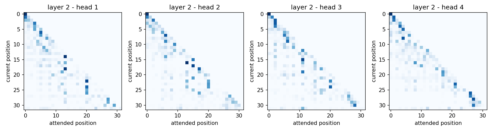
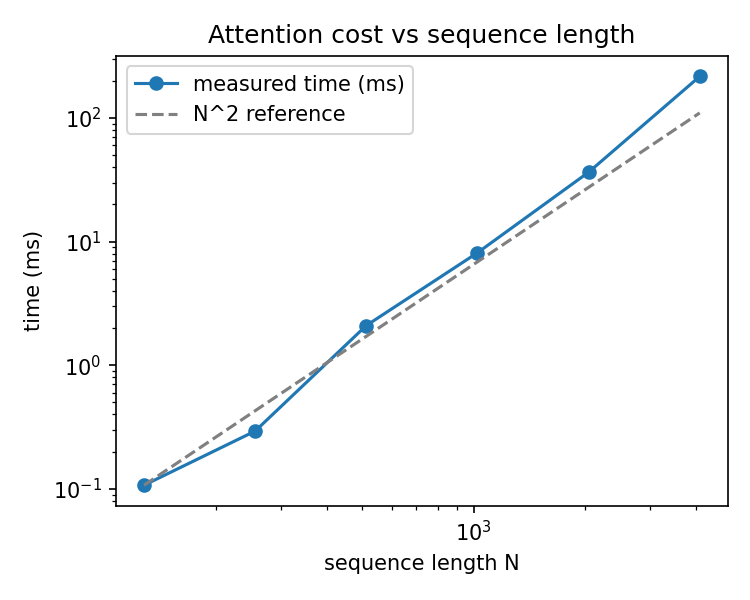

# transformer-explained

A small, readable, **from-scratch Transformer in PyTorch** that goes with the talk
*"How Does a Transformer Really Work?"*.

The goal is not performance. It is to let you read a couple of hundred lines of code and see every idea
from the slides working: next-token prediction, attention, multi-head, the context window,
and the quadratic cost.

```
token ids → Embedding (+ position) → [ Attention → Feed-forward ] × L → softmax → next-token probabilities
```

## Contents

| Path | What it is |
|---|---|
| [`tinytransformer/attention.py`](tinytransformer/attention.py) | The attention formula, `softmax(QKᵀ/√d_k)·V`, plus the causal mask |
| [`tinytransformer/model.py`](tinytransformer/model.py) | Multi-head attention, positional encoding, feed-forward, Transformer block, `TinyGPT` with `generate()` |
| [`examples/01_attention_by_hand.py`](examples/01_attention_by_hand.py) | Attention on a toy sentence with hand-made Q/K/V, printed step by step |
| [`examples/02_train_and_generate.py`](examples/02_train_and_generate.py) | Trains a tiny character-level model on CPU, then generates text |
| [`examples/03_complexity_benchmark.py`](examples/03_complexity_benchmark.py) | Measures how memory and time grow with sequence length |
| [`tests/`](tests/test_attention.py) | Checks shapes, causality, and agreement with PyTorch's reference implementation |

## Quick start

```bash
git clone https://github.com/<your-user>/transformer-explained.git
cd transformer-explained
python -m venv .venv && source .venv/bin/activate   # optional
pip install -e ".[dev]"                             # installs torch, matplotlib, pytest

python -m pytest                                    # sanity checks
python examples/01_attention_by_hand.py --plot
python examples/02_train_and_generate.py --plot
python examples/03_complexity_benchmark.py --plot
```

Plots are written to `outputs/`. Python ≥ 3.9 and PyTorch ≥ 2.0 are required. No GPU is needed.

## The core idea in 10 lines

This is the whole mechanism (from [`attention.py`](tinytransformer/attention.py)):

```python
def scaled_dot_product_attention(q, k, v, mask=None):
    d_k = q.shape[-1]
    scores = q @ k.transpose(-2, -1) / math.sqrt(d_k)      # N x N grid of relevance scores
    if mask is not None:
        scores = scores.masked_fill(mask == 0, float("-inf"))  # hide the future
    weights = F.softmax(scores, dim=-1)                    # each row sums to 1
    return weights @ v, weights                            # blend the values
```

$$\text{Attention}(Q, K, V) = \text{softmax}\!\left(\frac{QK^\top}{\sqrt{d_k}}\right)V$$

- **Q (query):** what the current token is looking for.
- **K (key):** the label each token offers to the others.
- **V (value):** the content that gets passed on when the Q–K match is strong.
- In a real model, Q, K and V are **learned linear projections** of each token's vector.
- Dividing by √d_k keeps the softmax from saturating, which would shrink the gradients.

## Slides → code

| Slide | Where to look |
|---|---|
| Predict the next token | `TinyGPT.generate()`: predict, append, repeat |
| Why replace RNN/LSTM? | The whole sequence goes through one batched matrix product, no loop over time steps |
| Attention without jargon | Example 01 |
| Query, Key, Value | `scaled_dot_product_attention` and `MultiHeadAttention.w_q / w_k / w_v` |
| Multi-head | `MultiHeadAttention`; example 02 `--plot` shows what each head does |
| Context window | `TinyGPT(max_len=N)`; `generate()` drops anything older than N tokens; `forward()` refuses longer inputs |
| Quadratic complexity | Example 03 |
| Full pipeline | `TinyGPT.forward()` |

## Example 01: attention by hand

Hand-designed 3-feature vectors (*noun*, *animate*, *pronoun*) make the result readable. The query
of **"it"** asks for an animate noun, so it should attend to **"animal"** rather than **"street"**.

```
Step 3 - attention weights of 'it' (softmax, sums to 1):
       the   2.3%
    animal  75.0%  #############################
   crossed   2.3%
       the   2.3%
    street  13.3%  #####
   because   2.3%
        it   2.3%
```

The values above are **hand-crafted for illustration**, not learned. A trained model discovers such
patterns on its own.

## Example 02: train and generate

A character-level `TinyGPT` (about 105k parameters, 2 layers, 4 heads, context window of 64 characters)
is trained on [`data/tiny_corpus.txt`](data/tiny_corpus.txt), a short original text about Transformers.

Sample of the training log (your numbers will differ slightly by machine and PyTorch version):

```
step     1   loss 3.844
step   100   loss 1.768
step   400   loss 0.164
step   800   loss 0.120
(a random guess would give a loss of about 3.64)
```

The corpus is tiny, so the model mostly memorizes it, and sampled text is a noisy mix of memorized fragments. That is expected here.

To train on your own text, create a UTF-8 text file (for example, `my_text.txt`) and pass it to the script:
```
python examples/02_train_and_generate.py --file my_text.txt --steps 3000 --max-len 128
````
For example, if your file is located in `data/my_text.txt`:
```
python examples/02_train_and_generate.py --file data/my_text.txt --steps 3000 --max-len 128
````
With `--plot`, the script saves the attention weights of each head in the last layer:



Every map is **lower-triangular**: that is the causal mask, since a token can only look at itself and
earlier tokens. The heads develop different patterns from the same training signal.

## Example 03: the O(N²) bottleneck

```
     N |  score matrix | x vs prev
   128 |        0.1 MB |         -
   256 |        0.2 MB |      4.0x
   512 |        1.0 MB |      4.0x
  1024 |        4.0 MB |      4.0x
  2048 |       16.0 MB |      4.0x
  4096 |       64.0 MB |      4.0x
```

- The **memory** column is exact: doubling N multiplies the N × N score matrix by 4, and 10× the length costs 100×.
- The **time** column is measured on your machine and is noisy at small N. It approaches a 4× jump per doubling
  only when computation dominates.
- This is the plain implementation. Optimized kernels such as FlashAttention avoid storing the full matrix, but the
  amount of computation still grows as N².



## What this is *not*

- Not a production model: single-file simplicity over speed (no KV cache, no dropout, no mixed precision).
- Not a trained LLM: the tiny corpus is there to show the mechanics.
- The sinusoidal positional encoding is one option among several; modern LLMs often use other schemes.

## Reference

- Vaswani et al., *Attention Is All You Need*, 2017 (arXiv:1706.03762): the original Transformer paper.

## License

"MIT, see LICENSE. Copyright (c) Team 1 ai-operations-specialist mayerfeld.consulting."
